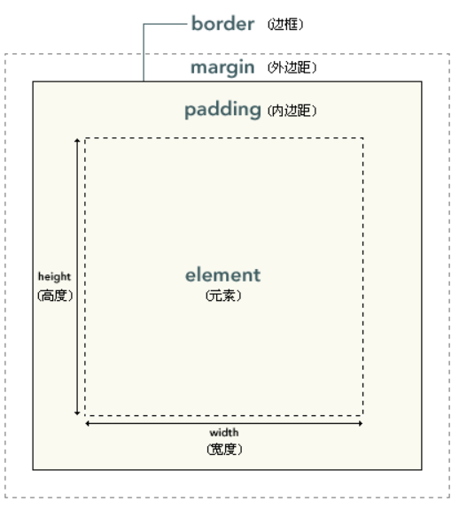
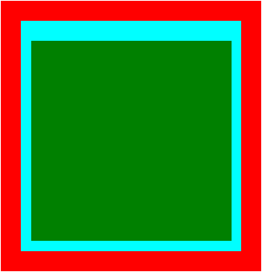

## 网页布局

### 文档流（normal flow）

网页是一个多层的结构，一层罩着一层，通过CSS可以分别为每一层设置样式，作为用户只能看到最顶上一层，这些层中，最底下的一层称为**文档流**，是网页的基础，所创建的元素在文档流中排列。

*元素在文档流中的特点：*

- **块元素**：块元素在页面中独占一行，默认宽度是父元素的全部，默认高度被子元素给撑开，自上向下垂直排列。
- **行内元素**：行内元素只占自身的大小，从左向右排列。

### 盒子模型

CSS将页面中的元素都设置为一个矩形的盒子，每一个盒子由如下几个部分组成：<u>内容区content, 内边距padding, 边框border, 外边距margin</u>。



```css
.box1{
	/* width和height设置的是内容区的高度和宽度 */
	width: 200px;
	height: 200px;
	background-color: aqua;

	/* border边框有三个属性需要进行设置 */
	border-width: 10px;
	border-color: red;
	border-style: solid;
}
```

#### 盒子模型-边框

##### 边框的大小

使用样式`border-width`指定边框的大小。

```css
/* 当border-width为4个值：上右下左 */
border-width: 10px 20px 30px 40px;
```

```css
/* 当border-width为3个值：上左右下 */
border-width: 10px 20px 10px;
```

```css
/* 当border-width为两个值：上下 左右 */
border-width: 20px 40px;
```

```css
/* 当border-width为一个值：上下左右 */
border-width: 10px;
```

##### 边框的颜色

使用样式`border-color`来指定边框的颜色，规则和`border-width`一样，默认使用color的颜色作为边框的颜色。

##### 边框的样式

使用样式`border-style`指定边框的样式，solid（实线），dotted（点状虚线），dashed（虚线），double（双线），规则和`border-width`一样。

##### border简写属性

```css
border: 10px red solid;
```

#### 盒子模型-内边距（padding）

盒子的大小是由<u>内容区</u>+<u>内边距</u>+<u>边框</u>共同决定的，设置padding样式可以有两种方式：

```css
.box{
	width: 200px;
	height: 200px;
	background-color: aqua;

	border: 20px red solid;

	padding-top: 10px;
	padding-right: 10px;
	padding-bottom: 10px;
	padding-left: 10px;

	padding: 20px 10px 10px 10px;
}

.inner{
	width: 100%;
	height: 100%;
	background-color: green;
}
```

```html
<body>
    <div class="box">
        <div class="inner"></div>
    </div>
</body>
```



#### 盒子模型-外边距（margin）

外边距margin不会影响盒子的可见大小，但是外边距会影响盒子的位置，外边距也和盒子模型的其他结构一样有四个方向：`margin-top, margin-right, margin-bottom, margin-left`，上和左两个方向移动元素自身，下和右两个方向移动其他元素。margin可以设置负值。默认情况下设置`margin-right`不会产生任何效果。

#### 盒子的水平布局

当一个元素在其父元素中时，占的是其内容区的位置，并且水平布局必须满足以下的等式：

`margin-left+border-left+padding-left+width+padding-right+border-right+margin-right=父元素内容区的宽度`

**如果等式不满足**：

- 当这7个值里面没有auto的时候，浏览器会自动地调整margin-right的大小。

- 当有auto值的时候（只有width、margin-left、margin-right可以设置为auto），如果是两个外边距为auto，会被调整到相同的外边距；如果是width宽度和一个外边距为auto，则宽度会被调整到最大；如果是三个值都为auto，则宽度会被调整到最大。

#### 盒子的垂直布局

在没有设置父元素的高度的情况下，父元素的高度被子元素的高度撑开，但如果设置了高度，如果子元素的高度超过了父元素设置的高度，就会产生**溢出现象**，使用`overflow`属性来对溢出进行设置，可选的值有：`visible`可见`hidden`隐藏`scroll`自动生成两个滚动条`auto`自动根据情况生成滚动条。

#### 盒子模型-外边距重叠问题

相邻的垂直方向的外边距会发生重叠现象：

- 兄弟元素：兄弟元素间相邻的垂直方向的外边距会选取两个外边距间的较大值。
- 父子元素：可能会导致父子元素同时被调整位置。

#### 行内元素的盒子模型

行内元素不支持设置`width`和`height`，但对于`padding`和`border`和`margin`都可以设置，只是垂直方向不会影响到页面的布局。

- `display`属性：用于设置元素显示的类型，可选值有`inline`、`block`、`inline-block`、`table`、`none`。
- `visibility`属性：用于设置元素的显示状态，可选值有`visible`、`hidden`。

#### 浏览器的默认样式

一般情况下，浏览器都会为元素设置一些默认样式，而我们在开发之前需要去去除这些样式，可以使用写好的重置样式表来去除浏览器设置的默认样式。