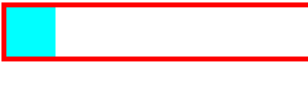
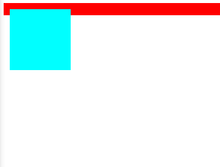

## 网页布局

### 文档流（normal flow）

网页是一个多层的结构，一层罩着一层，通过CSS可以分别为每一层设置样式，作为用户只能看到最顶上一层，这些层中，最底下的一层称为**文档流**，是网页的基础，所创建的元素在文档流中排列。

*元素在文档流中的特点：*

- **块元素**：块元素在页面中独占一行，默认宽度是父元素的全部，默认高度被子元素给撑开，自上向下垂直排列。
- **行内元素**：行内元素只占自身的大小，从左向右排列。

### 盒子模型

CSS将页面中的元素都设置为一个矩形的盒子，每一个盒子由如下几个部分组成：<u>内容区content, 内边距padding, 边框border, 外边距margin</u>。


```css
.box1{
	/* width和height设置的是内容区的高度和宽度 */
	width: 200px;
	height: 200px;
	background-color: aqua;

	/* border边框有三个属性需要进行设置 */
	border-width: 10px;
	border-color: red;
	border-style: solid;
}
```

#### 盒子模型-边框

##### 边框的大小

使用样式`border-width`指定边框的大小。

```css
/* 当border-width为4个值：上右下左 */
border-width: 10px 20px 30px 40px;
```

```css
/* 当border-width为3个值：上左右下 */
border-width: 10px 20px 10px;
```

```css
/* 当border-width为两个值：上下 左右 */
border-width: 20px 40px;
```

```css
/* 当border-width为一个值：上下左右 */
border-width: 10px;
```

##### 边框的颜色

使用样式`border-color`来指定边框的颜色，规则和`border-width`一样，默认使用color的颜色作为边框的颜色。

##### 边框的样式

使用样式`border-style`指定边框的样式，solid（实线），dotted（点状虚线），dashed（虚线），double（双线），规则和`border-width`一样。

##### border简写属性

```css
border: 10px red solid;
```

#### 盒子模型-内边距（padding）

盒子的大小是由<u>内容区</u>+<u>内边距</u>+<u>边框</u>共同决定的，设置padding样式可以有两种方式：

```css
.box{
	width: 200px;
	height: 200px;
	background-color: aqua;

	border: 20px red solid;

	padding-top: 10px;
	padding-right: 10px;
	padding-bottom: 10px;
	padding-left: 10px;

	padding: 20px 10px 10px 10px;
}

.inner{
	width: 100%;
	height: 100%;
	background-color: green;
}
```

```html
<body>
    <div class="box">
        <div class="inner"></div>
    </div>
</body>
```


#### 盒子模型-外边距（margin）

外边距margin不会影响盒子的可见大小，但是外边距会影响盒子的位置，外边距也和盒子模型的其他结构一样有四个方向：`margin-top, margin-right, margin-bottom, margin-left`，上和左两个方向移动元素自身，下和右两个方向移动其他元素。margin可以设置负值。默认情况下设置`margin-right`不会产生任何效果。

#### 盒子的水平布局

当一个元素在其父元素中时，占的是其内容区的位置，并且水平布局必须满足以下的等式：

`margin-left+border-left+padding-left+width+padding-right+border-right+margin-right=父元素内容区的宽度`

**如果等式不满足**：

- 当这7个值里面没有auto的时候，浏览器会自动地调整margin-right的大小。

- 当有auto值的时候（只有width、margin-left、margin-right可以设置为auto），如果是两个外边距为auto，会被调整到相同的外边距；如果是width宽度和一个外边距为auto，则宽度会被调整到最大；如果是三个值都为auto，则宽度会被调整到最大。

#### 盒子的垂直布局

在没有设置父元素的高度的情况下，父元素的高度被子元素的高度撑开，但如果设置了高度，如果子元素的高度超过了父元素设置的高度，就会产生**溢出现象**，使用`overflow`属性来对溢出进行设置，可选的值有：`visible`可见`hidden`隐藏`scroll`自动生成两个滚动条`auto`自动根据情况生成滚动条。

#### 盒子模型-外边距重叠问题

相邻的垂直方向的外边距会发生重叠现象：

- 兄弟元素：兄弟元素间相邻的垂直方向的外边距会选取两个外边距间的较大值。
- 父子元素：可能会导致父子元素同时被调整位置。

#### 行内元素的盒子模型

行内元素不支持设置`width`和`height`，但对于`padding`和`border`和`margin`都可以设置，只是垂直方向不会影响到页面的布局。

- `display`属性：用于设置元素显示的类型，可选值有`inline`、`block`、`inline-block`、`table`、`none`。
- `visibility`属性：用于设置元素的显示状态，可选值有`visible`、`hidden`。

#### 浏览器的默认样式

一般情况下，浏览器都会为元素设置一些默认样式，而我们在开发之前需要去去除这些样式，可以使用写好的重置样式表来去除浏览器设置的默认样式。

#### 盒子的大小

默认情况下，盒子的大小由内容区、内边距和边框共同决定，`box-sizing`属性，设置盒子尺寸的计算方式，可选值有`content-box`默认值和`border-box`宽度和高度用来设置整个盒子可见框的大小。

#### 盒子的轮廓、阴影和圆角

`outline`用来设置盒子的轮廓，用法和`border`一样，区别就在于，`outline`不会影响盒子的大小，而`border`会影响。

`box-shadow`用来设置盒子的阴影，有如下的这几个参数：水平偏移量、垂直偏移量、阴影的模糊半径、阴影的颜色。

使用属性`border-radius`设置圆角，因为盒子有四个角，也可以分别对`border-top-left-radius` `border-top-right-radius` `border-bottom-right-radius` `border-bottom-left-radius`进行设置。

```css
.box1{
	width: 100px;
	height: 100px;
	background-color: aqua;
	/* 设置边框 */
	border: 10px solid red;
	/* 设置轮廓 */
	outline: 10px solid red;
	/* 设置阴影 */
	box-shadow: 10px 10px 25px rgba(0, 0, 0, .3);
}

.box2{
	width: 200px;
	height: 200px;
	background-color: aqua;
	/* 4个值，分别对左上 右上 右下 左下四个值进行设置 */
	border-radius: 10px 20px 10px 20px;
	/* 3个值，分别对左上 右上/左下 右下三个值进行设置 */
	border-radius: 10px 20px 10px;
	/* 两个值，分别对左上/右下 右上/左下两个值进行设置 */
	border-radius: 10px 20px;
}
```

### 浮动

#### 浮动的简介

通过浮动，可以使一个元素向其父元素的左侧和右侧移动，使用`float`属性来设置元素的浮动，可选值有：`none` `left` `right`。

在设置了浮动之后，之前讲过的水平布局的等式就不需要强制成立，元素设置浮动以后，会完全从文档流中脱离，不再占用文档流的位置，所以元素下边的还在文档流中的会自动向上移动。

浮动的一些特点：

- 浮动元素会完全脱离文档流，不再占用文档中的位置。
- 设置浮动以后元素会向父元素的左侧或右侧移动。
- 浮动元素默认不会从父元素中移出。
- 浮动元素向左或向右移动时，不会超过它前边的其他浮动元素。
- 如果浮动元素的上边是一个没有浮动的块元素，则浮动元素无法上移。
- 浮动元素不会超过它上面的浮动的兄弟元素，最多就是和它一样高。
- 浮动元素不会盖住文字，文字会自动环绕在浮动元素周围。

元素在脱离文档流之后，元素的一些特点会发生变化：

**块元素：**

- 块元素不再占页面的一行。
- 脱离文档流后，块元素的宽度和高度被内容给撑开。

行内元素：

- 行内元素脱离文档流后编程块元素，特点和块元素一样。

### 高度塌陷和BFC

什么是**高度塌陷**呢？在浮动的布局中，父元素的高度默认是被子元素的高度所撑开的，当子元素浮动之后，其会完全地脱离文档流，子元素会从文档流中脱离，将无法撑起父元素的高度，导致父元素的高度丢失，父元素的高度丢失之后，其下的元素会自动上移，导致页面布局混乱。

**BFC：**块级格式化环境（Block Formatting  Context），BFC是CSS中的一个隐含的属性，可以为一个元素开启BFC，元素开启BFC后有如下的一些特点：

- 开启BFC的元素不会被浮动元素所覆盖。
- 开启BFC的元素子元素和父元素外边距不会重叠。
- 开启BFC的元素可以包含浮动的子元素。

可以通过一些特殊方式来开启BFC：

- 设置元素的浮动。（不推荐）
- 将元素设置为行内块。（不推荐）
- 将元素的`overflow`设置为一个非`visible`的值，常用方式是设置：`overflow:hidden`。

### clear属性

由于一个元素的浮动，导致其他元素位置上移。如果我们不想要某个元素因为其他元素的影响而改变它的位置，可以为其设置`clear`属性，`clear`的作用是清除浮动元素对当前元素产生的影响，可选值有`left`和`right`和`both`，分别是清楚左浮动，清除右浮动，清楚影响较大的。原理是会自动为元素添加一个上外边距。

### 高度塌陷问题的最终解决方案

什么是高度塌陷？





高度塌陷就是当子元素浮动后，父元素没有内容来支撑就会出现塌陷。

**解决方案：**使用`clear`，配合`::after`伪元素，在父元素最后位置设置一个伪元素，清除浮动元素对其影响即可。

### clearfix

```css
.clearfix::before,
.clearfix::after{
            content: '';
            display: table;
            clear: both;
}
```

上面的代码是一个通用的代码，可以解决高度塌陷和外边距重叠的问题。