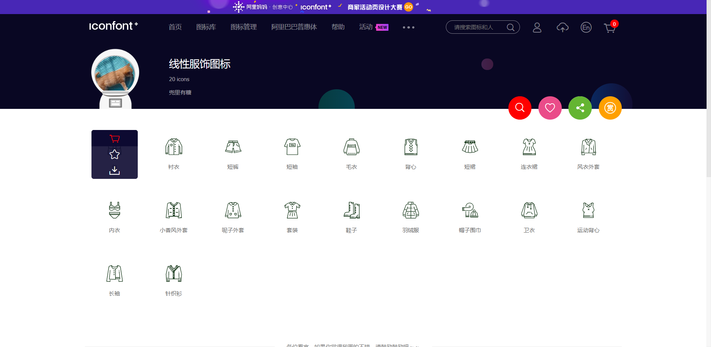
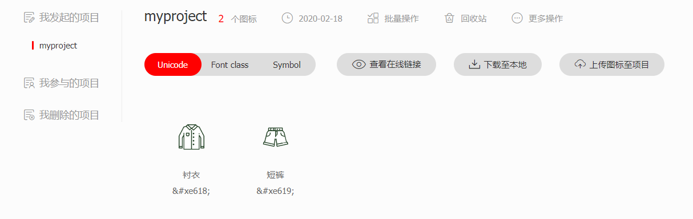

## 字体和背景

### 字体

和字体相关的样式有`color`，`font-size`，`font-family`等样式，分别指定字体的颜色，字体的大小，字体族。

#### 字体族font-family

可选值有`serif`，`sans-serif`，`monospace`，分别表示*衬线字体*，*非衬线字体*，*等宽字体*。也可以同时指定多个字体，当第一个字体无法使用时就使用第二个字体，以此类推。字体显示是根据用户的电脑来的，如果用户安装了那个字体，就可以显示，反之无法显示。但也可以使用以下代码指定用户去下载服务器的字体来进行显示：

  ```css
@font-face {
	/* 自定义的指定的字体的名字 */
	font-family: 'myfont';
	/* 服务器中指定的字体的路径 */
	src: '';
}
  ```

#### 图标字体（icon-font）

在网页中会经常使用一些图标，可以通过图片来引入图标，但是图片的大小本身比较大，并且非常的不灵活，所以在使用图标时，我们还可以将图标设置为字体，通过`font-face`形式来对字体进行引入，这样我们就可以通过使用字体的方式来使用图标。

##### FontAwesome

使用：

- 下载。
- 解压缩。
- 将all.css引入。
- 使用图标字体，直接通过类名来使用图标字体，`class="fas fa-bell"`。

使用图标字体的常用方式：

- 通过类来使用。
- 通过实体的方式来使用。
- 通过伪元素的方式来使用。使用方法：通过`before`或`after`来使用，在`content`中设置字体的编码，设置字体的样式，如果是`fab`，设置`font-family: 'Font Awesome 5 Brands'`，如果是`fas`，设置`font-family: 'Font Awesome 5 Free'; font-weight: 900;`就可以。

##### iconfont

iconfont是阿里的图标库，里面提供了很多图标字体以供使用，使用步骤如下：

- 选取想要使用的图标，点击加入购物车的图标。



- 点击购物车，将所选取的图标添加至项目。



- 下载至本地，将内容引入自己的项目即可使用。

#### 行高

`line-height`属性用来设置文字的行高，表示文字实际的高度，设置行高有两种方式：1、指定一个大小（px em）。2、设定一个数，代表字体指定的倍数。

##### 字体框

字体框就是字体存在的格子，设置`font-size`属性实际上就是设置字体框的高度，行高会在字体框的上下平均分配。

通过将`line-height`的值设置为父元素的高度可以使元素垂直居中，一般情况下，设置了`line-height`值之后就可以不再设置父元素的高度，因为父元素被子元素所撑开。

#### 字体的简写属性

可以设置字体的简写属性，语法是`font: (font-weight) (font-style) 字体大小 行高 字体值 `，`font-weight`和`font-style`默认值为normal。

#### 文本的水平和垂直对齐

##### 文本的水平对齐

通过设置`text-align`属性来设置文本的水平对齐，可选值有：`left right center justify`，分别是左对齐，右对齐，中心对齐，两端对齐。

##### 文本的垂直对齐

通过设置`vertical-align`属性来设置文本的垂直对齐，可选值有`base-line top bottom middle`，分别代表基线对齐，顶端对齐，底端对齐和中间对齐，一个典型的应用场景是当在块元素内放图片时，可能底部不能贴合父元素的边框，这时候可以吧垂直对齐方式改为非基线对齐的方式，还需要注意的一点是，这里的middle设置的效果不是居中的效果，一般需要自己设置。

#### 其他的一些文本样式

`text-decoration`属性用于设置文本修饰，可选值有`none underline line-througn overline`，分别代表无，下划线，删除线，上划线。

`white-space`属性设置网页如何处理空白，可选值：`normal nowrap pre`分别代表正常，不换行，保留空白。

### 背景

#### 设置背景颜色

使用样式`background-color`设置元素的背景颜色。

#### 设置背景图片

使用样式`background-image`设置元素的背景为图片。可以同时设置背景图片和背景颜色，这样背景颜色会成为图片的背景色。如果背景的图片小于元素，图片会在元素中平铺，如果大于元素，图片无法完全显示。

`background-repeat`属性，用于设置背景的重复方式，可选值：`repeat repeat-x repeat-y no-repeat`，分别是重复，沿x方向重复，沿y方向重复，背景图片不重复。

`background-position`属性，用于设置背景图片的位置，通过`top left right center bottom`几个值设置，类似9宫格的位置。也可以通过设置偏移量来指定图片的位置。

#### 其他的一些属性

`background-size`属性，设置图片的大小，第一个参数为宽度，第二个参数为高度，如果只写一个，第二个值默认变为auto，也可以设置为`cover`表示将图片等比例进行缩放，设置为`contain`将图片完整显示。

`background-origin`属性，表示起始点。

`background-clip`属性，设置背景范围，可选值和`background-origin`一样，`border-box padding-box content-box`。

`background-attachment`属性，设置背景图片是否跟随元素移动，可选值`scroll fixed`，`scrollzong`表示随元素移动，`fixed`表示不和元素移动。

#### 关于背景图片的应用的一些问题

因为图片属于网页中的外部资源，外部资源都需要浏览器单独发送请求进行加载，浏览器加载时是按需加载的，不用就不会加载，所以在使用时，某些时候可能会出现按钮闪烁的情况。

解决图片闪烁的问题，可以将多个小图片统一保存到一个大图片中，然后通过调整`background-position`来显示，这样这些图片会同时加载到网页中。这个技术在网页中应用十分广泛，称为雪碧图（CSS-Sprite）。

#### 雪碧图的使用步骤

- 确定想要使用的图标
- 测量图标的大小
- 根据测量结果创建一个元素
- 将雪碧图设置为元素的背景图片
- 设置一个偏移量以正确的显示

#### 雪碧图的特点

一次性将多图片加载进页面，降低请求的次数，加快访问速度，提升用户体验。

#### 背景的渐变

通过渐变可以设置一些复杂的背景颜色，可以实现从一个颜色向其他颜色过渡的效果，注意，**渐变是图片**，要通过设置`background-image`来设置。

##### 线性渐变

设置值为`linear-gradient()`，颜色沿着一条直线发生变化，里面可以指定多个颜色的值，会平均在元素内分布，也可以自己手动指定渐变的分布情况。线性渐变的开头可以指定一个渐变的方向，`to left, right, bottom, top`，`deg turn`表示度数和圈数。

##### 可以平铺的线性渐变

`repeating-linear-gradient()`，效果是在元素内重复渐变。

#####  径向渐变

通过设置`radial-gradient`属性来设置径向渐变，语法为`radial-gradient(大小 at 位置, 颜色 位置 [颜色 位置] ...)`，径向渐变就是圆径方向上渐变。